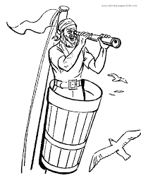
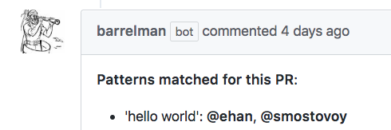

# Barrelman

**Watch the things that matter to you on Github.**



*The Barrelman is stationed in the crow's nest of an oceangoing vessel as a navigational aid. In early ships, the nest was simply a barrel lashed to the tallest mast.*  
  
 Create rules for your repo in barrelman.yml and spy on your coworker's PRs. If a rule is triggered, you'll be added as a reviewer, a comment will be made, and Pierre will ping you.  



Review other's PRs and watch for things like:
 * Importing "that library"
 * Calling deprecated function
 * Using a bad word and not changing it in placeholder label
 
  
## Writing Rules 
Barrelman runs Python's regex engine on your rules. A rule consists of a pattern and a list of github usernames or teamnames.  
Put rules in a file named **barrelman.yml** in the master branch of the repo. Rules will be checked against newly added changes from the diff of the PR.
  

 ````
'hello world':
    - dylan
    - mary
    - team/infra
 ````

<br/>

Barrelman supports **regex**. Here are some examples. Check here for Python's regex syntax and remember to escape special characters.  
https://docs.python.org/2/library/re.html#regular-expression-syntax
````
# Rule for urls
'https?://(?:[-\w.]|(?:%[\da-fA-F]{2}))+':
    - wonderwoman
    
# Rule to match "todo" at beginning and end of word, case insensitive. For ex, "TODOIST" will not match 
'\b(?i)TODO\b'
    - tchalla
    
# Rule with newlines
'line1\n\+line2':
    - tonystark
```` 


Barrelman supports **github teams**. Specify a team by using "team/" in front of the team name.
````
'tooling':
    - drake
    - kanye
    - team/devtools
````
<br/>

Barrelman will detect if the barrelman.yml file is corrupted on master or if a PR that changes it mucks it up.  
If you receive a comment on a PR stating that something is wrong with the file, carefully check the format of the barrelman.yml file of the specified branch.   
**Common mistakes:** tabs instead of 4 spaces, no space after dash, missing colon after rule.
